# Access Control Defaults

## Domain Admin

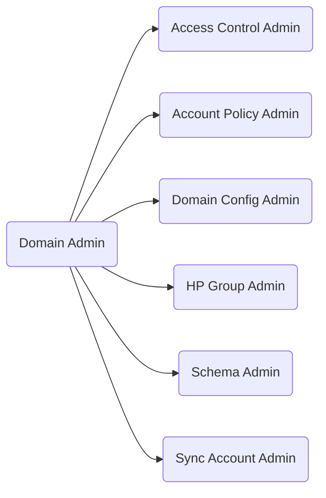

## IDM Admin

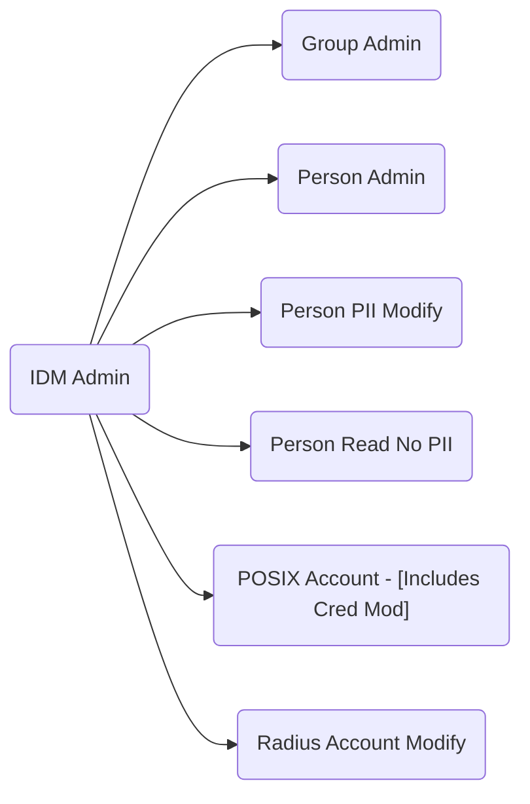

## Integration Admin

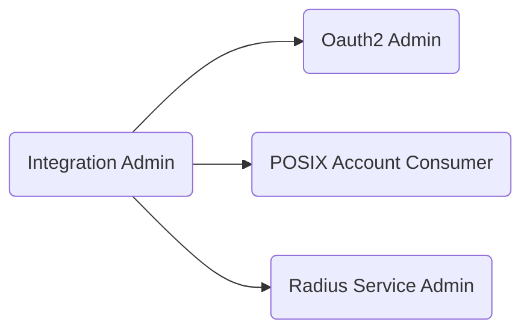

## Help Desk

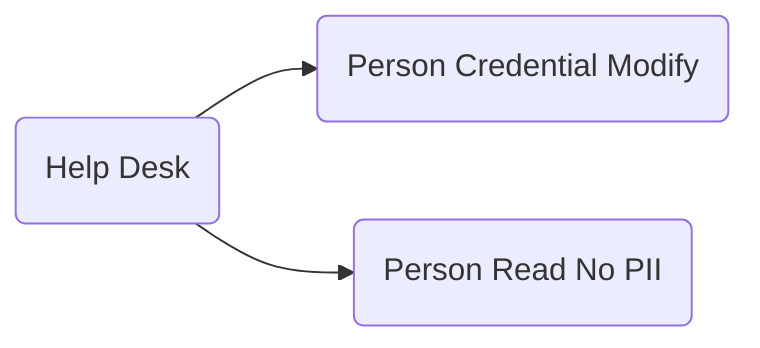

## Account "Self"

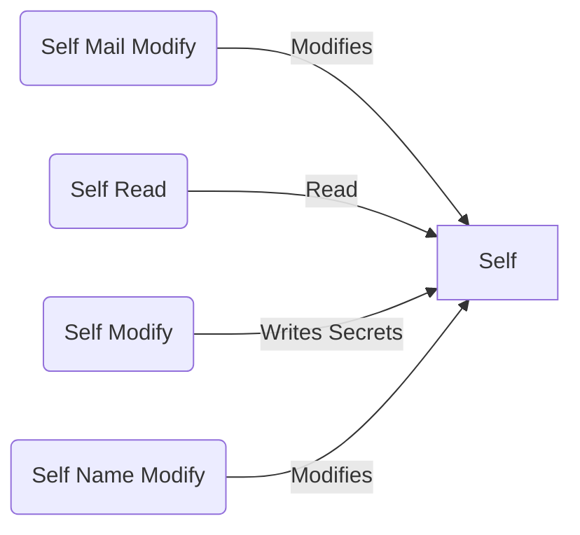

## Account-Related

Duplicated for Service Accounts, HP persons, HP service Accounts.

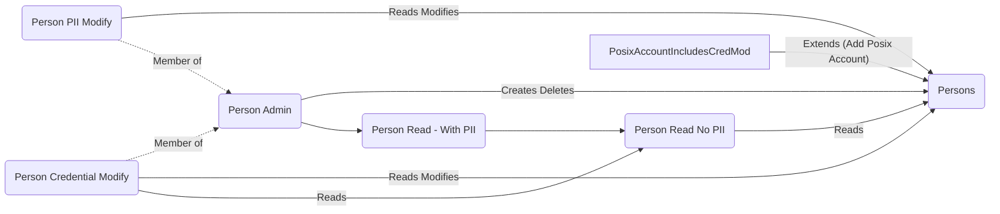

## Domain and Schema

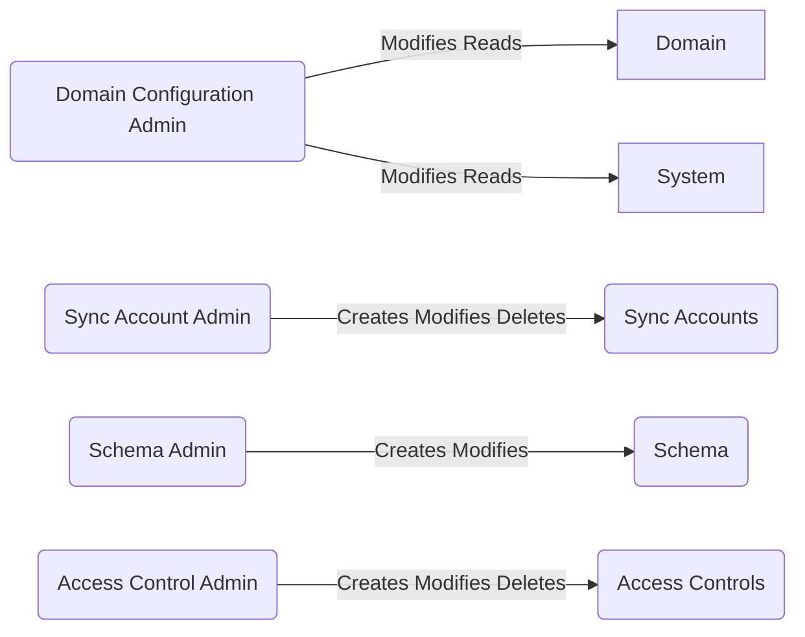

## High-Priv and Groups

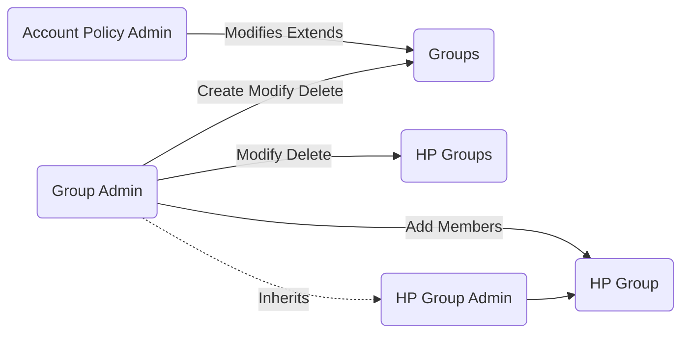

## OAuth2 Specific

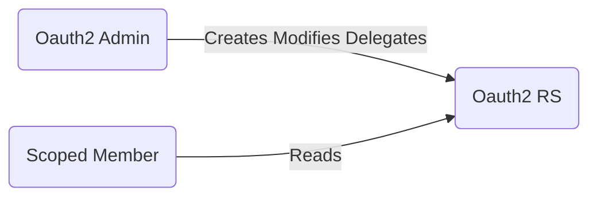

## POSIX-Specific

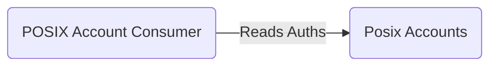

## Radius

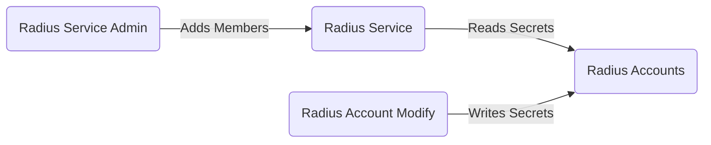

## Recycle Bin Admin

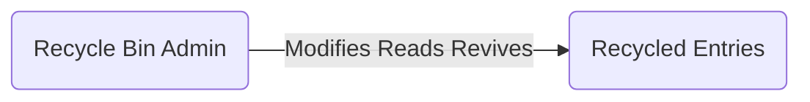
