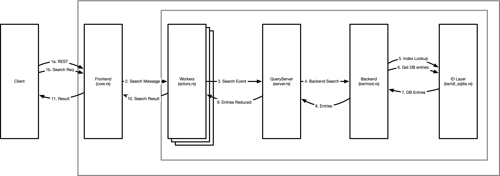

## Architectural Overview

Kanidm has a number of components and layers that make it up. As this project is continually
evolving, if you have questions or notice discrepancies with this document please contact William
(Firstyear) at any time.

## Tools

Kanidm Tools are a set of command line clients that are intended to help administrators deploy,
interact with, and support a Kanidm server installation. These tools may also be used for servers or
machines to authenticate and identify users. This is the "human interaction" part of the server from
a CLI perspective.

## Clients

The `kanidm` client is a reference implementation of the client library, that others may consume or
interact with to communicate with a Kanidm server instance. The tools above use this client library
for all of its actions. This library is intended to encapsulate some high level logic as an
abstraction over the REST API.

## Proto

The `kanidm` proto is a set of structures that are used by the REST and raw API's for HTTP
communication. These are intended to be a reference implementation of the on-the-wire protocol, but
importantly these are also how the server represents its communication. This makes this the
authoritative source of protocol layouts with regard to REST or raw communication.

## Kanidmd (main server)

Kanidmd is intended to have minimal (thin) client tools, where the server itself contains most logic
for operations, transformations, and routing of requests to their relevant datatypes. As a result,
the `kanidmd` section is the largest component of the project as it implements nearly everything
required for IDM functionality to exist.

# Search

Search is the "hard worker" of the server, intended to be a fast path with minimal overhead so that
clients can acquire data as quickly as possible. The server follows the below pattern.

(1) All incoming requests are from a client on the left. These are either REST requests, or a
structured protocol request via the raw interface. It's interesting to note the raw request is
almost identical to the queryserver event types - where as REST requests we have to generate request
messages that can become events.

The frontend uses a webserver with a thread-pool to process and decode network I/O operations
concurrently. This then sends asynchronous messages to a worker (actor) pool for handing.

(2) These search messages in the actors are transformed into "events" - a self contained structure
containing all relevant data related to the operation at hand. This may be the event origin (a user
or internal), the requested filter (query), and perhaps even a list of attributes requested. These
events are designed to ensure correctness. When a search message is transformed to a search event,
it is checked by the schema to ensure that the request is valid and can be satisfied securely.

As these workers are in a thread pool, it's important that these are concurrent and do not lock or
block - this concurrency is key to high performance and safety. It's also worth noting that this is
the level where read transactions are created and committed - all operations are transactionally
protected from an early stage to guarantee consistency of the operations.

3. When the event is known to be consistent, it is then handed to the queryserver - the query server
   begins a process of steps on the event to apply it and determine the results for the request.
   This process involves further validation of the query, association of metadata to the query for
   the backend, and then submission of the high-level query to the backend.

4. The backend takes the request and begins the low-level processing to actually determine a
   candidate set. The first step in query optimisation, to ensure we apply the query in the most
   efficient manner. Once optimised, we then use the query to query indexes and create a potential
   candidate set of identifiers for matching entries (5.). Once we have this candidate id set, we
   then retrieve the relevant entries as our result candidate set (6.) and return them (7.) to the
   backend.

5. The backend now deserialises the databases candidate entries into a higher level and structured
   (and strongly typed) format that the query server knows how to operate on. These are then sent
   back to the query server.

6. The query server now applies access controls over what you can / can't see. This happens in two
   phases. The first is to determine "which candidate entries you have the rights to query and view"
   and the second is to determine "which attributes of each entry you have the right to perceive".
   This separation exists so that other parts of the server can _impersonate_ users and conduct
   searches on their behalf, but still internally operate on the full entry without access controls
   limiting their scope of attributes we can view.

7. From the entries reduced set (ie access controls applied), we can then transform each entry into
   it's protocol forms - where we transform each strong type into a string representation for
   simpler processing for clients. These protoentries are returned to the front end.

8. Finally, the protoentries are now sent to the client in response to their request.

# Write

The write path is similar to the search path, but has some subtle differences that are worth paying
attention to.

.. image:: diagrams/write-flow.png :width: 800

(1), (2) Like search, all client operations come from the REST or raw apis, and are transformed or
generated into messages. These messages are sent to a single write worker. There is only a single
write worker due to the use of copy-on-write structures in the server, limiting us to a single
writer, but allowing search transaction to proceed without blocking in parallel.

(3) From the worker, the relevant event is created. This may be a "Create", "Modify" or "Delete"
event. The query server handles these slightly differently. In the create path, we take the set of
entries you wish to create as our candidate set. In modify or delete, we perform an impersonation
search, and use the set of entries within your read bounds to generate the candidate set. This
candidate set will now be used for the remainder of the writing operation.

It is at this point, we assert access controls over the candidate set and the changes you wish to
make. If you are not within rights to perform these operations the event returns an error.

(4) The entries are now sent to the pre-operation plugins for the relevant operation type. This
allows transformation of the candidate entries beyond the scope of your access controls, and to
maintain some elements of data consistency. For example one plugin prevents creation of system
protected types where another ensures that uuid exists on every entry.

(5) These transformed entries are now returned to the query server.

(6) The backend is sent the list of entries for writing. Indexes are generated (7) as required based
on the new or modified entries, and the entries themself are written (8) into the core db tables.
This operation returns a result (9) to the backend, which is then filtered up to the query server
(10)

(11) Provided all operations to this point have been successful, we now apply post write plugins
which may enforce or generate different properties in the transaction. This is similar to the pre
plugins, but allows different operations. For example, a post plugin ensurs uuid reference types are
consistent and valid across the set of changes in the database. The most critical is memberof, which
generates reverse reference links from entries to their group memberships, enabling fast rbac
operations. These are done as post plugins because at this point internal searches can now yield and
see the modified entries that we have just added to the indexes and datatables, which is important
for consistency (and simplicity) especially when you consider batched operations.

(12) Finally the result is returned up (13) through (14) the layers (15) to the client to inform
them of the success (or failure) of the operation.

# IDM

TBD

## Radius

The radius components are intended to be minimal to support a common set of radius operations in a
container image that is simple to configure. If you require a custom configuration you should use
the python tools here and configure your own radius instance as required.
