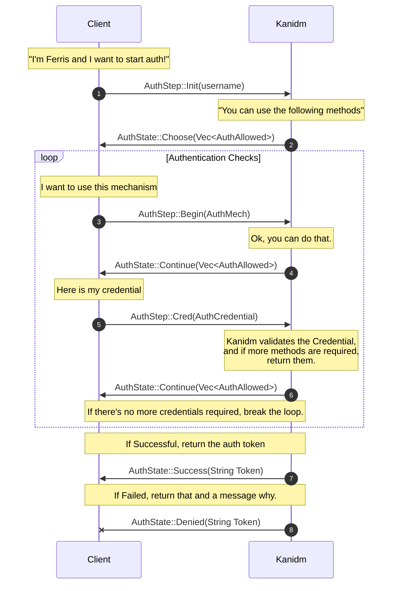

# User Authentication Flow

This authentication flow is for interactive users. If you're using a
[service account](../../accounts/service_accounts.md), use
[Bearer authentication](../../accounts/service_accounts.html#api-tokens-with-kanidm-httpsrest-api) with the token.

1. Client sends an init request. This can be either:
   1. `AuthStep::Init` which just includes the username, or
   2. `AuthStep::Init2` which can request a "privileged" session
2. The server responds with a list of authentication methods. (`AuthState::Choose(Vec<AuthAllowed>)`)
3. Client requests auth with a method (`AuthStep::Begin(AuthMech)`)
4. Server responds with an acknowledgement (`AuthState::Continue(Vec<AuthAllowed>)`). This is so the challenge can be
   included in the response, for Passkeys or other challenge-response methods.
   - If required, this challenge/response continues in a loop until the requirements are satisfied. For example, TOTP
     and then Password.
5. The result is returned, either:
   - Success, with the User Auth Token as a `String`.
   - Denied, with a reason as a `String`.

