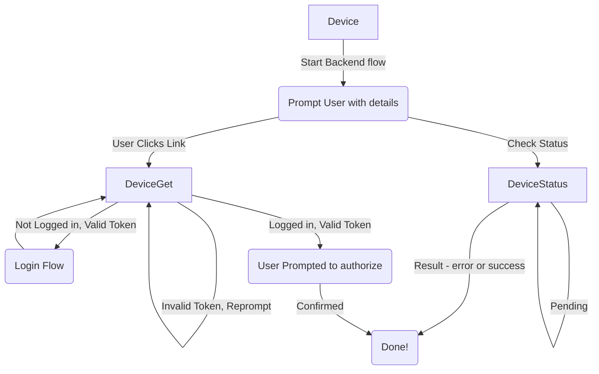

# OAuth2 Device Flow

The general idea is that there's two flows.

## Device/Backend

- Start an auth flow
- Prompt the user with the link
- On an interval, check the status
  - Still pending? Wait.
  - Otherwise, handle the result.

## User

- Go to the "check user code" page
- Ensure user is authenticated
- Confirm that the user's happy for this auth session to happen
  - This last step is the usual OAuth2 permissions/scope prompt

