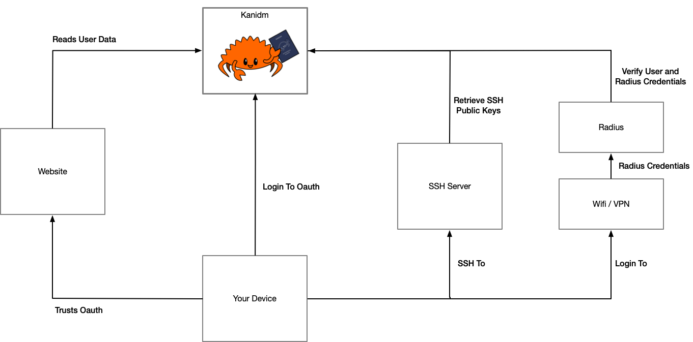

# Introduction to Kanidm

Kanidm is an identity management server, acting as an authority on account information,
authentication and authorisation within a technical environment.

The intent of the Kanidm project is to:

- Provide a single truth source for accounts, groups and privileges.
- Enable integrations to systems and services so they can authenticate accounts.
- Make system, network, application and web authentication easy and accessible.
- Secure and reliable by default, aiming for the highest levels of quality.

<!-- deno-fmt-ignore-start -->

{{#template templates/kani-warning.md
imagepath=images
title=NOTICE
text=Kanidm is still a work in progress. Many features will evolve and change over time which may not be suitable for all users.
}}

<!-- deno-fmt-ignore-end -->

## Why do I want Kanidm?

Whether you work in a business, a volunteer organisation, or are an enthusiast who manages their
personal services, you need methods of authenticating and identifying to your systems, and
subsequently, ways to determine what authorisation and privileges you have while accessing these
systems.

We've probably all been in workplaces where you end up with multiple accounts on various systems -
one for a workstation, different SSH keys for different tasks, maybe some shared account passwords.
Not only is it difficult for people to manage all these different credentials and what they have
access to, but it also means that sometimes these credentials have more access or privilege than
they require.

Kanidm acts as a central authority of accounts in your organisation and allows each account to
associate many devices and credentials with different privileges. An example of how this looks:

A key design goal is that you authenticate with your device in some manner, and then your device
will continue to authenticate you in the future. Each of these different types of credentials, from
SSH keys, application passwords, to RADIUS passwords and others, are "things your device knows".
Each password has limited capability, and can only access that exact service or resource.

This helps improve security; a compromise of the service or the network transmission does not grant
you unlimited access to your account and all its privileges. As the credentials are specific to a
device, if a device is compromised you can revoke its associated credentials. If a specific service
is compromised, only the credentials for that service need to be revoked.

Due to this model, and the design of Kanidm to centre the device and to have more per-service
credentials, workflows and automation are added or designed to reduce human handling.

## Library documentation

Looking for the `rustdoc` documentation for the libraries themselves?
[Click here!](https://kanidm.com/documentation/)
