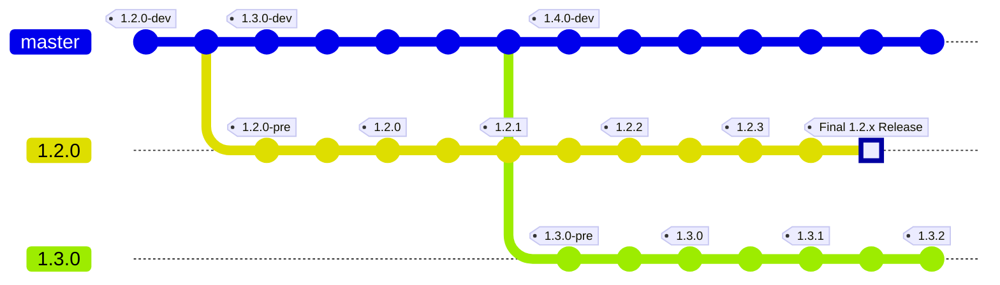

# Kanidm - Support and Release Processes

# Introduction

This document describes the Kanidm project teams support and release version processes.

While we have made every effort to ensure this document is complete, in the event that something is missing or if you
have a question, please [open a discussion](https://github.com/kanidm/kanidm/discussions).

The version of this document found
[on the project page](https://github.com/kanidm/kanidm/blob/master/book/src/support.md) is considered authoritative and
applies to all versions.

## Release Schedule and Versioning

Kanidm is released on a 3 month (quarterly) schedule.

- February 1
- May 1
- August 1
- November 1

Versions follow semver using `major.minor.patch` with an optional `-tag`.

- development branch: `X.Y.Z-dev`
- pre-release branch: `X.Y.Z-pre`
- stable branch: `X.Y.Z`

Release branches will be created and tagged 7 days prior to a release. The version will be set to the pre-release
version.

The first stable release is version 1.2.0. All releases prior are release candidate, beta or alpha builds and will no
longer be supported as of the release of 1.2.0.

## Support

Stable releases will be supported for 4 months after their release date. This allows a 1 month support overlap between N
and N+1 versions.

Stable releases will have the following support provided during their support window.

- Security fixes
- Fixes for flaws leading to dataloss or corruption
- Fixes that impact the ability to upgrade
- Other quality fixes at the discretion of the project team

Distributions should track the stable branch.

### Replication

All nodes must be the same version. A topology may contain up to a maximum of 2 nodes.

### Upgrade Policy

Upgrades are supported from 1 release (minor version) before the current stable release.

> Example: A server running 1.2.0 may upgrade to version 1.3.0. A server running 1.2.0 may not upgrade to 1.4.0.

### Tool Versions

Command line tools (`kanidm`) and sync connectors (`kanidm-ipa-sync`, `kanidm-ldap-sync`) must be matched versions with
the server that they communicate with at all times.

### Unix Clients

The server supports communication from unix clients with a version from 1 release (minor version) before the servers
release.

> Example: A server running 1.4.0 supports unix clients running 1.4.0 and 1.3.0 of the unix client tools. Unix client
> tools of 1.2.0 and lower would not be supported.

### API stability

Kanidm has a number of APIs with different stability guarantees. APIs that are stable will only receive breaking changes
in the case of an ethics, security or potential data corruption issue.

Stable APIs are:

- LDAP protocol operations
- JSON HTTP end points which use elements from
  [`proto/src/v1`](https://github.com/kanidm/kanidm/blob/master/proto/src/v1)

All other APIs and interactions are not considered stable. Changes will be minimised if possible. This includes but is
not limited to:

- unix domain socket API of `kanidm_unixd` resolver
- unix admin domain socket for `kanidmd` server
- web user interface design and operations
- entry schema
- CLI interface of any command provided by kanidm unless otherwise noted above
- JSON HTTP end points which use elements from
  [`proto/src/internal.rs`](https://github.com/kanidm/kanidm/blob/master/proto/src/internal.rs)
- SCIM operations from [`proto/src/scim_v1`](https://github.com/kanidm/kanidm/blob/master/proto/src/scim_v1)

### Deprecation Policy

Features or APIs may be removed with 1 release versions notice. Deprecations will be announced in
[the Release Notes](https://github.com/kanidm/kanidm/blob/master/RELEASE_NOTES.md)

### Python module

The Python module will typically trail changes in functionality of the core Rust code, and has been developed as we have
needed it - please feel free to add functionality or improvements, or
[ask for them in a Github issue](http://github.com/kanidm/kanidm/issues/new/choose)!

All code changes will include full type-casting wherever possible.

### Project Discretion

In the event of an unforeseen or extraordinary situation, the project team may make decisions contradictory to this
document at their discretion. In these situation, the project team will make every effort to communicate the reason for
the decision and will attempt to minimise disruption to users.
