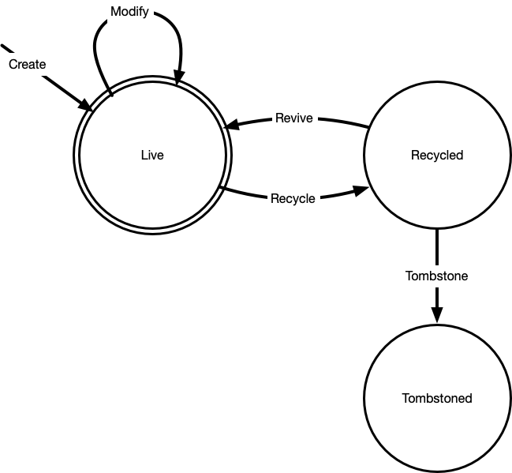

Replication Design and Notes
----------------------------

Replication is a critical feature to an IDM system, especially when deployed at major
sites and businesses. It allows for horizontal scaling of system read and write capacity,
improves fault tolerance (hardware fault, power fault, network fault, geographic disaster),
can improve client latency (positioning replicas near clients) and more.

Replication Background
======================

Replication is a directed graph model, where each node (server) and directed edge
(replication agreement) form a graph (topology). As the topology and direction can
be seen, nodes of the graph can be classified based on their data transit properties.

NOTE: Historically many replication systems used the terms "master" and "slave". This
has a number of negative cultural connotations, and is not used by this project.

* Read-Write server

This is a server that is fully writable. It accepts external client writes, and these
writes are propogated to the topology. Many read-write servers can be in a topology
and written to in parallel.

* Transport Hub

This is a server that is not writeable to clients, but can accept incoming replicated
writes, and then propogates these to other servers. All servers that are directly after
this server inthe topology must not be a read-write, as writes may not propogate back
from the transport hub. IE the following is invalid

::

    RW 1 ---> HUB <--- RW 2

Note the replication direction in this, and that changes into HUB will not propogate
back to RW 1 or RW 2.

* Read-Only server

Also called a read-only replica, or in AD an RODC. This is a server that only accepts
incoming replicated changes, and has no outbound replication agreements.

Replication systems are dictated by CAP theorem. This is a theory that states from
"consistency, availability and paritition tolerance" you may only have two of the
three at any time.

* Consistency

This is the property that a write to a server is guaranteed to be consistent and
acknowledged to all servers in the replication topology. A change happens on all
nodes or it does not happen at all, and clients contacting any server will always
see the latest data.

* Availability

This is the property that every request will recieve a non-error response without
the guarantee that the data is "up to date".

* Partition Tolerance

This is the property that your topology in the face of patition tolerance will
continue to provide functional services (generally reads).

Almost all systems expect partition tolerance, so the choice becomes between consistency
and availability. Kanidm has chosen availability, as the needs of IDM dictate that we
always function even in the face of partition tolerance, and when other failures occur.

This AP selection is often called "eventually consistent".

Conflict Resolution
===================

As consistency is not a property that we can uphold in an AP system, we must handle
the possibility of inconsistent data and the correct methods to handle it to bring
a system into a consistent state. There are two levels that inconsistency can occur
at in a system like Kanidm.

* Object Level
* Attribute Level

Object Level inconsistency occurs when two read-write servers who are partitioned,
both allocate the same entry UUID to an entry. Since the uuid is the "primary key"
which anchors all other changes, and can not be duplicated, when the paritioning
is resolved, the replication will occur, and one of the two items must be discarded
as inconsistent.

Attribute Level inconsistency occurs within a single entry, where the same attribute
is altered by two servers who are partition. When replicated, this attribute's
state must be resolved in a manner consistent to schema of the system.

An additional complexity is that both servers must be able to resolve this
conflict in isolation, without further communication. All servers must arrive
at the same result, necesitating a set of conflict management rules that must
be the same to all members of the replication topology.

As a result, almost all facets of replication are designed around the possible
handling of these conflict cases, and tracking of changes as they occur in
a manner that allows forward and reverse application of changes.

CID
===

A CID is a change identifier. This is a compound type consisting of the domain uuid,
the server uuid, and a 64 bit timestamp. This allows selecting of changes by domain
origin, a unique server, a timerange, or a selection of these properties. This may
also be called a change serial number (CSN) in other application like 389 Directory
Server

Change
======

A single change is a CID associated to the UUID of entries that have had their state
altered in an operation. These state records are atomic units that describe a set of
changes that must occur together to be considered valid. There may be multiple state
assertions in a change.

The possible states are:

* NonExistant
* Live
* Recycled
* Tombstone

The possible state transitions are:

* Create
* Modify
* Recycle
* Revive
* Tombstoned
* Purge (*not changelogged!*)

A pseudocode change could be:

::

    CID: { d_uuid, s_uuid, ts }
    transitions: [
        create: uuid, entry_state { ... }
        modify: uuid, modifylist
        recycle: uuid
        tombstoned: uuid
    ]

The valid transitions are representing in a NFA, where any un-listed transition is
considered invalid and must be discarded.

::

    create + NonExistant -> Live
    modify + Live -> Live
    recycle + Live -> Recycled
    revive + Recycled -> Live
    tombstoned + Recycled -> Tombstone
    purge + Tombstone -> NonExistant

Changelog
=========

The changelog stores a series of changes associated by their CID, allowing querying
of changes based on CID properties. The changelog stores changes from multiple
server uuid's or domain uuid's, acting as a single linear history of affects on
the data of this system.

Changelog Comparison - Replication Update Vector (RUV)
======================================================

A changelog is a single servers knowledge of all changes that have occured in history
of a topology. Of course, the point of replication is that multiple servers are exchanging
their changes, and potentially that a server must proxy changes to other servers. For this
to occur we need a method of comparing changelog states, and then allowing fractional
transmission of the difference in the sets.

To calculate this, we can use our changelog to construct a table called the replication
update vector. The RUV is a single servers changelog state, categorised by the originating
server of the change. A psudeo example of this is:

::

    |-----|--------------------|--------------------|--------------------|
    |     | {d_uuid, s_uuid A} | {d_uuid, s_uuid B} | {d_uuid, s_uuid C} |
    |-----|--------------------|--------------------|--------------------|
    | min | T4                 | T6                 | T0                 |
    |-----|--------------------|--------------------|--------------------|
    | max | T8                 | T16                | T7                 |
    |-----|--------------------|--------------------|--------------------|

Summarised, this shows that on our server, our changelog has changes from A for time range
T4 to T8, B T6 to T16, and C T0 to T7.

Individiually, a RUV does not allow much, but now we can compare RUVs to another server. Lets
assume a second server exists with the RUV of:

::

    |-----|--------------------|--------------------|--------------------|
    |     | {d_uuid, s_uuid A} | {d_uuid, s_uuid B} | {d_uuid, s_uuid C} |
    |-----|--------------------|--------------------|--------------------|
    | min | T4                 | T8                 | T0                 |
    |-----|--------------------|--------------------|--------------------|
    | max | T6                 | T10                | T11                |
    |-----|--------------------|--------------------|--------------------|

This shows the server has A T4 to T6, B TT8 to T10, and C T0 to T11. Let's assume that
we are *sending* changes from our first server to this second server. We perform a diff of the
RUV and find that for the changes of A, T7 to T8 are not present on the second server, and that
changes T11 to T16 are not present. Since C has a more "advanced" state than us, we do not
need to send anything (and later, this server should send changes to us!).

So now we know that we must send A T7 to T8 and B T11 to T16 for this replica to be brought up
to the state we hold.

You may notice the "min" and "max". The purpose of this is to show how far we may rewind our
changelog - we have changes from min to max. If a server provides it's ruv, and it's max
is lower than our min, we must consider that server has been disconnected for "too long" and
we are unable to supply changes until an administrator intervenes.

Changelog Purging
=================

In order to prevent infinite growth of the changelog, any change older than a fixed window X
is trimmed from the changelog. When trimming occurs this moves the "min" CID in the RUV up to
a higher point in time.

RUV cleaning
============

TODO:

Conflict UUID Generation
========================

As multiple servers must arrive at the same UUID so that they are all in a deterministic
state, the UUID of a conflicting entry should be generated in a deterministic manner.

TODO:

Conflict Class
==============

TODO: Must origUUID,

Object Level Conflict Handling
===============================

With the constructs defined, we have enough in place to be able to handle various scenarioes.
For the purposes of these discussions we will present two servers with a series of changes
over time.

Let's consider a good case, where no conflict occurs.

::

        Server A                Server B
    T0:
    T1: Create E
    T2:           -- repl -->
    T3:                         Modify E
    T4:          <-- repl --

Another trivial example is the following.

::

        Server A                Server B
    T0:
    T1: Create E1
    T2:                         Create E2
    T3:           -- repl -->
    T4:          <-- repl --

These situations are clear, and valid. However, as mentioned the fun is when we have scenarios
that conflict. To resolve this, we combine the series of changes, ordered by time, and then
re-apply these changes, discarding changes that would be invalid for those states. As a reminder:

::

    create + NonExistant -> Live
    modify + Live -> Live
    recycle + Live -> Recycled
    revive + Recycled -> Live
    tombstoned + Recycled -> Tombstone
    purge(*) + Tombstone -> NonExistant

Lets now show a conflict case:

::

        Server A                Server B
    T0:
    T1: Create E1
    T2:                         Create E1
    T3:           -- repl -->
    T4:          <-- repl --

Notice that both servers create E1. In order to resolve this conflict, we use the only
synchronisation mechanism that we possess - time. On Server B at T3 when the changelog
of Server A is recieved, the events are replayed, and linearised to:

::

    T0: NonExistant E1 # For illustration only
    T1: Create E1 (from A)
    T2: Create E1 (from B)

As the event at T2 can not be valid, the change at T2 is *skipped* - E1 from B is turned
into a conflict + recycled entry. See conflict UUID generation above.

Infact, having this state machine means we can see exactly what can and can not be resolved
correctly as combinations. Here is the complete list of valid combinations.

::

    T0: Create E1 (Live)
    T1: Modify E1 (Live)

    T0: Create E1 (Live)
    T1: Recycle E1 (Recycled)

    T0: Modify E1 (Live)
    T1: Modify E1 (Live)

    T0: Modify E1 (Live)
    T1: Recycle E1 (Recycled)

    T0: Recycle E1 (Recycled)
    T1: Revive E1 (Live)

    T0: Recycle E1 (Recycled)
    T1: Tombstone E1 (Tombstoned)

    T0: Revive E1 (Live)
    T1: Modify E1 (Live)

    T0: Revive E1 (Live)
    T1: Recycle E1 (Recycled)

If two items in a changelog are not a pair of these valid orderings, then we discard the
later operation.

It's worth noting that if any state of a change conflicts, the entire change is discarded
as we consider changes to be whole, atomic units of change.

Attribute Level Conflict Handling
=================================

TODO:
