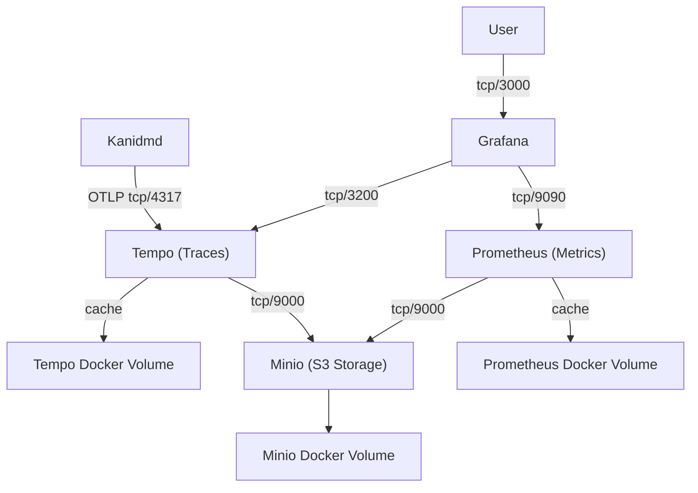

# OpenTelemetry for Kanidm

First, start the containers. You can use docker-compose if you know how, or `./startup.sh` is a shortcut. You'll need docker (or similar) and docker-compose (or something that can handle `docker-compose.yml`).

Once that's stopped scrolling for a bit, run the Kanidm server, setting the `otel_grpc_url` to `http://localhost:4317`

Then access the [Grafana UI](http://localhost:3000/explore?panes=%7B%22G-2%22:%7B%22datasource%22:%22tempo%22,%22queries%22:%5B%7B%22refId%22:%22A%22,%22datasource%22:%7B%22type%22:%22tempo%22,%22uid%22:%22tempo%22%7D,%22queryType%22:%22traceqlSearch%22,%22limit%22:20,%22filters%22:%5B%7B%22id%22:%2219b1a582%22,%22operator%22:%22%3D%22,%22scope%22:%22span%22%7D,%7B%22id%22:%22service-name%22,%22tag%22:%22service.name%22,%22operator%22:%22%3D%22,%22scope%22:%22resource%22,%22value%22:%5B%22kanidmd%22%5D,%22valueType%22:%22string%22%7D%5D%7D%5D,%22range%22:%7B%22from%22:%22now-6h%22,%22to%22:%22now%22%7D%7D%7D&schemaVersion=1&orgId=1) and start clicking on traces 😁

## Architecture of the docker containers

